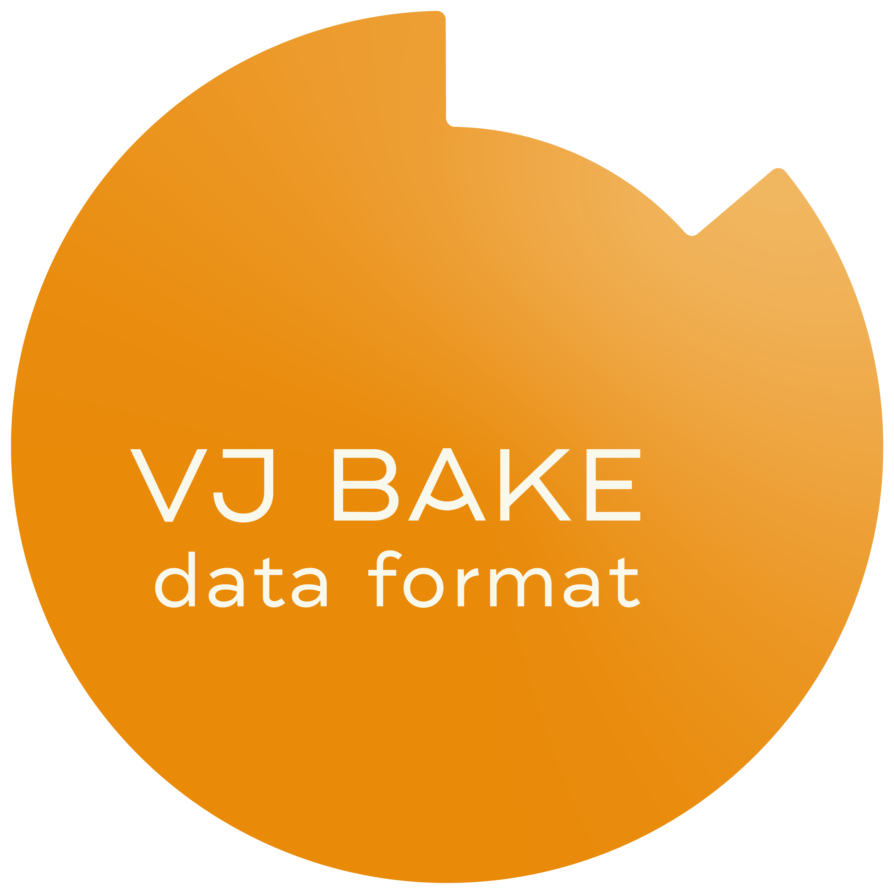

# VJB Format

VJB (`.vjb`) is an open bundle format for temporal media prepared for live
playback.

It is built for a simple idea:

prepare the heavy work ahead of time, then perform with media that can jump,
freeze, reverse, loop, and hit exact moments without falling apart under
pressure.

VJB is meant for tools that care about rhythm, timing, markers, and reliable
realtime behavior, not just raw asset storage.

## What VJB Packages

- A primary baked media file
- Marker-driven transport metadata
- Optional thumbnails, analysis data, and future extensions

In practice, that means a VJB bundle can carry both the image and the intent:
where to jump, how to move, where a segment begins, and how it should behave
once playback lands there.

## Why It Exists

Modern visual performance often swings between two extremes:

- smooth temporal motion
- hard rhythmic cuts

The point of VJB is to make both feel direct.

Instead of asking a live playback tool to do expensive temporal processing at
show time, VJB assumes that interpolation, baking, and packaging can happen in
advance. What remains at runtime is the part that matters in performance:
fast seek, stable playback, and expressive transport control.

## Core Values

- Open by default
- Deterministic playback behavior
- Simple packaging with standard tooling
- Clear separation between authoring and playback
- Extensible without breaking core interoperability

## Status

This repository contains the first public working draft of the format.

The current focus is deliberately narrow:

- define the container
- define the manifest
- define marker and transport semantics
- define the minimum rules needed for interoperable playback

## Repository Layout

- [`spec/SPEC.md`](./spec/SPEC.md): current specification draft
- [`spec/PRINCIPLES.md`](./spec/PRINCIPLES.md): design principles for the format
- [`schema/manifest.schema.json`](./schema/manifest.schema.json): draft JSON Schema for `manifest.json`
- [`examples/`](./examples/): implementation-oriented manifest examples for valid,
  warning, and invalid cases

## Implementing V1

Recommended reader flow:

1. Open the `.vjb` file as a ZIP archive.
2. Read and parse `manifest.json`.
3. Validate schema shape plus the spec hard rules.
4. Resolve `media.primaryVideo.path` and confirm it stays inside the archive.
5. Extract the primary MOV to a local cache path.
6. Use `media.primaryVideo.frameCount` and `media.primaryVideo.fps` as the
   authoritative playback timing source.
7. Resolve segment bounds from marker `frame` plus `segmentEndMarkerId` or the
   next marker in frame order.
8. Apply playback state in this order: `transport` defaults, marker `state`,
   then any runtime overrides from the playback app.

Implementation notes:

- VJB carries bundle defaults and marker entry intent, not immutable runtime
  behavior.
- Playback apps may override `speed`, `direction`, `mode`, `easing`, and
  `quantizeUnit` at runtime.
- `media.primaryVideo.alpha` is the authoritative playback alpha flag for
  renderer setup; `source.hasAlpha` is descriptive source metadata.
- Unknown optional fields within a supported major version should be ignored,
  not treated as hard errors.

## Scope

VJB is:

- a bundle format
- a transport metadata format
- a playback-oriented interchange format

VJB is not:

- a new video codec
- a generic editing timeline format
- a vendor-locked project file

`VJB` is the format name. The specification is intended for use by multiple
authoring and playback tools and is not tied to any single vendor runtime.

## License

This repository is licensed under Apache-2.0.
